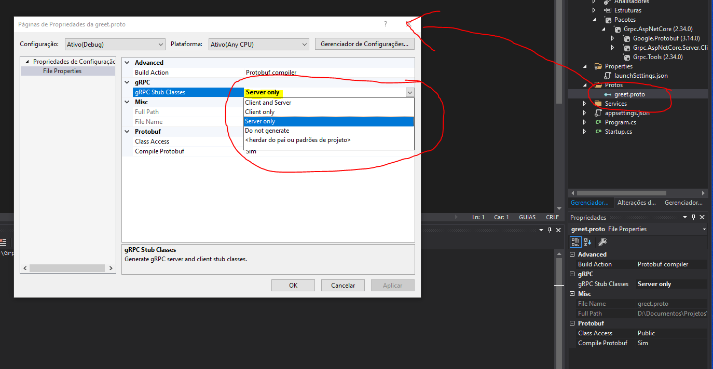
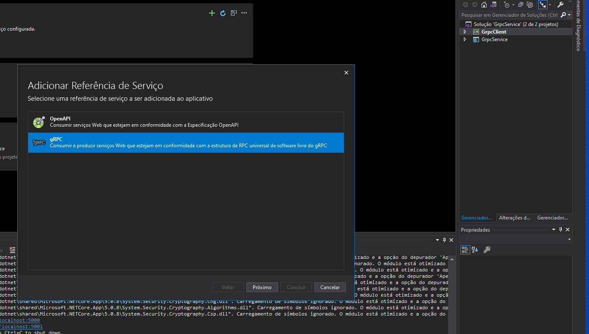
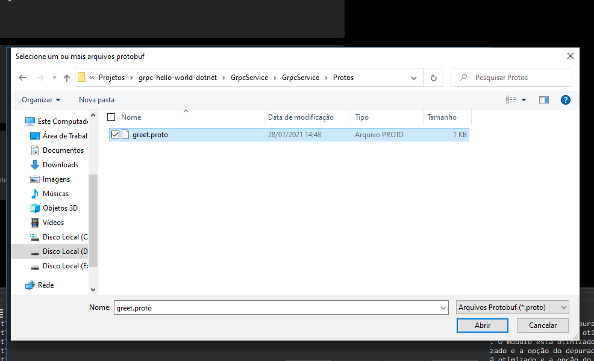
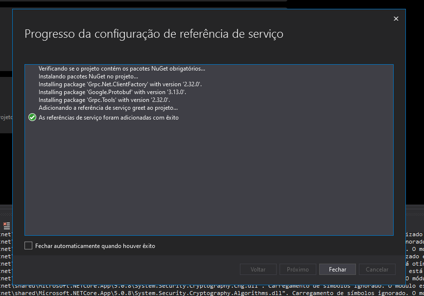
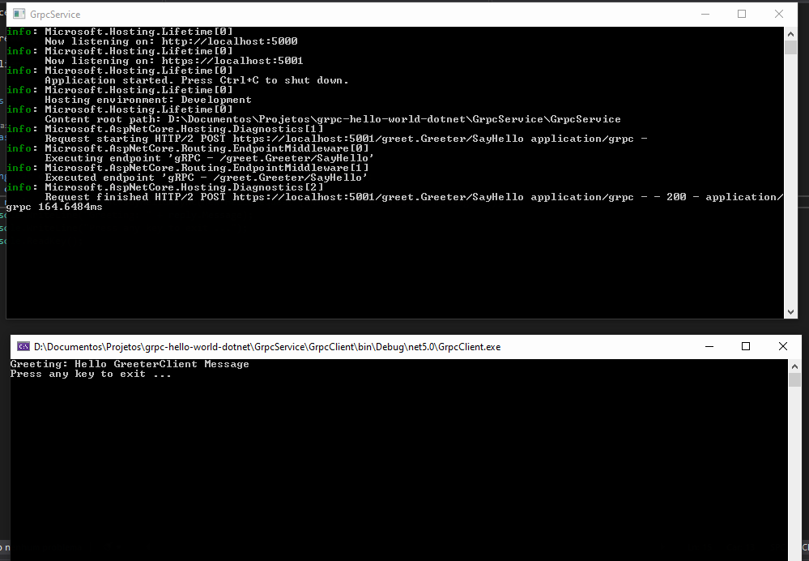

# grpc-hello-world-dotnet

Projeto de exemplo de uso da tecnologia gRPC. Foi criado um servidor web e um cliente do tipo console ambos com .Net.

## Criando Server

    dotnet new grpc -n server-name

## Criando Client

    dotnet new console -n client-name

### Configurando proto file

## Configurando Client

### Adicionando referência do server

## Como rodar

Adicionar os dois projetos a inicialização da solução (ou rodar ambos separados).

## Como criar outros métodos

    ### No Server

    - Adicionar método rpc dentro do arquivo [greet.proto](GrpcService/GrpcClient/../GrpcService/Protos/greet.proto) 
    - Buildar a aplicação para gerar o contrato automaticamente
    - Expor o método em uma classe de serviço como essa [GreeterService](GrpcService/GrpcService/Services/GreeterService.cs)

    ### No client

    - 

## Fonte

COGNIZANT SOFTVISION Youtube by [Building a gRPC service with .NET Core](https://youtu.be/5jsp1pN9nVg)
